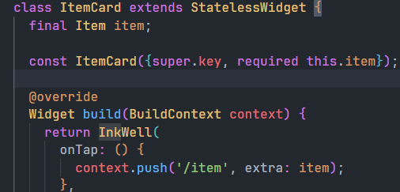

# Praktikum 1: Membangun Layout di Flutter
## Langkah 1: Buat Project Baru

## Langkah 2: Buka file lib/main.dart

## Langkah 3: Identifikasi layout diagram

## Langkah 4: Implementasi title row

# Praktikum 2: Implementasi button row
## Langkah 1: Buat method Column _buildButtonColumn

## Langkah 2: Buat widget buttonSection

## Langkah 3: Tambah button section ke body

# Praktikum 3: Implementasi text section
## Langkah 1: Buat widget textSection

## Langkah 2: Tambahkan variabel text section ke body

# Praktikum 4: Implementasi image section
## Langkah 1: Siapkan aset gambar

## Langkah 2: Tambahkan gambar ke body

## Langkah 3: Terakhir, ubah menjadi ListView

# Tugas Praktikum 1
Link Github : https://github.com/GE08T/layout_widget 

# Praktikum 5: Membangun Navigasi di Flutter
## Langkah 1: Siapkan project baru

## Langkah 2: Mendefinisikan Route

## Langkah 3: Lengkapi Kode di main.dart

## Langkah 4: Membuat data model

## Langkah 5: Lengkapi kode di class HomePage

## Langkah 6: Membuat ListView dan itemBuilder

## Langkah 7: Menambahkan aksi pada ListView

## Hasil Akhir

# Tugas Praktikum 2
## Untuk melakukan pengiriman data ke halaman berikutnya, cukup menambahkan informasi arguments pada penggunaan Navigator. Perbarui kode pada bagian Navigator menjadi seperti berikut.

## Tambahkan kode berikut pada blok fungsi build dalam halaman ItemPage. Setelah nilai didapatkan, anda dapat menggunakannya seperti penggunaan variabel pada umumnya. (https://docs.flutter.dev/cookbook/navigation/navigate-with-arguments)

## Ubahlah tampilan menjadi GridView seperti di aplikasi marketplace pada umumnya

## Silakan implementasikan Hero widget pada aplikasi belanja Anda dengan mempelajari dari sumber ini:

## Sesuaikan dan modifikasi tampilan sehingga menjadi aplikasi yang menarik. Selain itu, pecah widget menjadi kode yang lebih kecil. Tambahkan Nama dan NIM di footer aplikasi belanja Anda.

##  Cobalah modifikasi menggunakan plugin go_router, lalu dokumentasikan dan push ke repository Anda berupa screenshot setiap hasil pekerjaan beserta penjelasannya di file README.md. Kumpulkan link commit repository GitHub Anda kepada dosen yang telah disepakati!

Menambahkan dependensi go_router di pubspec.yaml

Mengganti implementasi di item_card untuk retrival data nya

Menambahkan app_router.dart

Mengganti implementasi dalam main.dart

