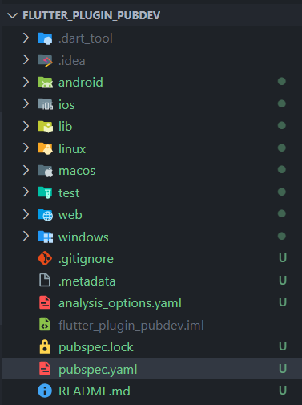
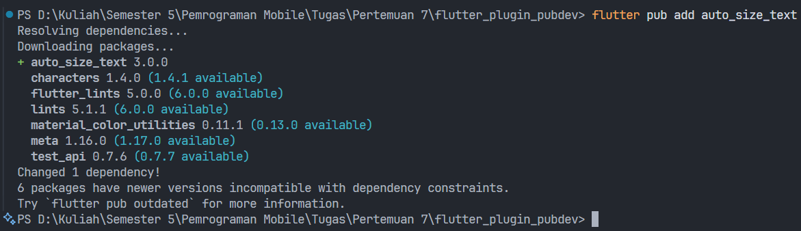
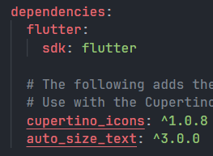
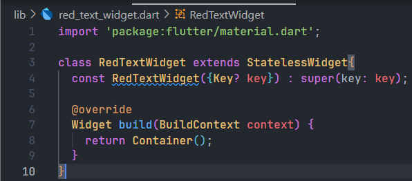
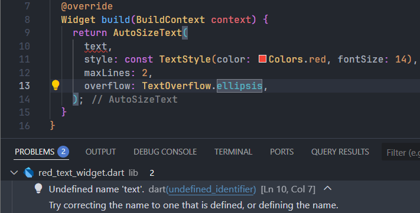
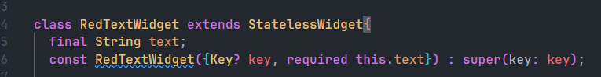
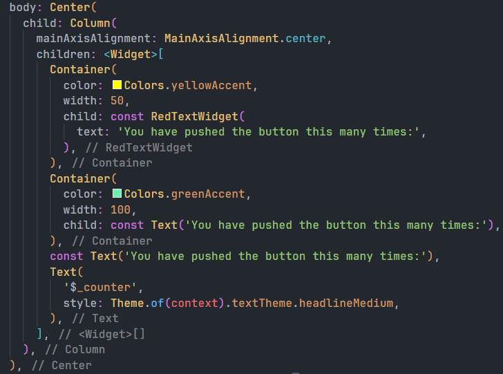
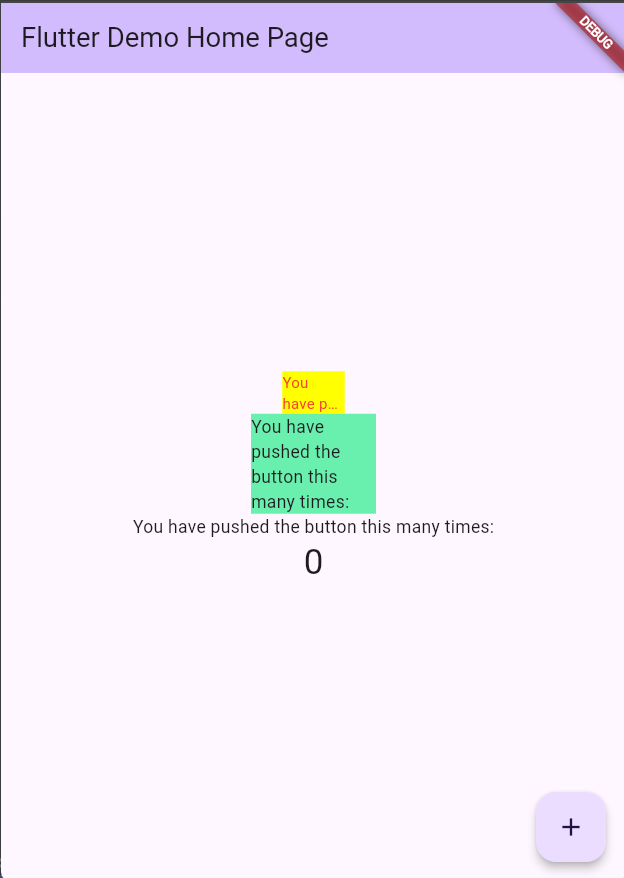

# Pertemuan 7

## Praktikum 
### Langkah 1: Buat Project Baru

### Langkah 2: Menambahkan Plugin

### Langkah 3: Buat file red_text_widget.dart

### Langkah 4: Tambah Widget AutoSizeText

Setelah Anda menambahkan kode di atas, Anda akan mendapatkan info error. Mengapa demikian? Jelaskan dalam laporan praktikum Anda!

Error ini disebabkan karena mencoba untuk memanggil sebuah variabel yang belum didefinisikan

### Langkah 5: Buat Variabel text dan parameter di constructor

### Langkah 6: Tambahkan widget di main.dart

Hasil Run 

## Tugas Praktikum

1. [x] Selesaikan Praktikum tersebut, lalu dokumentasikan dan push ke repository Anda berupa screenshot hasil pekerjaan beserta penjelasannya di file README.md!
2. Jelaskan maksud dari langkah 2 pada praktikum tersebut!

  Dalam langkah tersebut memanggil perintah yang berasal dari flutter paket manager untuk menambahkan sebuah paket eksternal kedalam project yaitu paket auto_size_text.

3. Jelaskan maksud dari langkah 5 pada praktikum tersebut!

  Dalam langkah ini mendeklarasikan sebuah variabel yang akan dijadikan parameter untuk RedTextWidet. Dimana parameter ini harus diisi setiap kali memanggil widget ini. Dengan tujuan agar dapat merubah text sesuai dengan penggunaanya.

4. Pada langkah 6 terdapat dua widget yang ditambahkan, jelaskan fungsi dan perbedaannya!

  - Widget pertama menggunakan RedTextWidget yang menggunakan library auto_size_text untuk menampilkan textnya sedangkan untuk Widget kedua mengguanakan widget Text bawaan flutter
  - Perbedaan dari kedua widget ini terdapat pada auto scalling yang ada pada auto_size_text dan juga perubahan pada perilaku overflow text terhadap wrappernya seperti ellipsis yang mengubah text menjadi ... diakhir ketika text melebihi wrappernya. 

5. Jelaskan maksud dari tiap parameter yang ada di dalam plugin auto_size_text berdasarkan tautan pada dokumentasi ini !

ini adalah parameter yang ada dalam library tersebut: 
  - textKey: Berfungsi untuk mengatur key untuk widget Text yang dihasilkan. 
  - style: Untuk menerapkan gaya (seperti warna, jenis huruf, dll.) pada teks. 
  - minFontSize: Menentukan ukuran teks terkecil yang diizinkan saat ukuran teks disesuaikan secara otomatis. 
  - maxFontSize: Menentukan ukuran teks terbesar yang diizinkan saat ukuran teks disesuaikan secara otomatis. 
  - stepGranularity: Mengatur seberapa besar perubahan ukuran font saat disesuaikan dengan batasan yang ada. 
  - presetFontSizes: Mendefinisikan semua kemungkinan ukuran font yang bisa digunakan. Nilai pada presetFontSizes harus dalam urutan menurun. 
  - group: Digunakan untuk menyinkronkan ukuran dari beberapa AutoSizeText widget. 
  - textAlign: Mengatur perataan teks secara horizontal (misalnya, rata kiri, kanan, atau tengah). 
  - textDirection: Menentukan arah teks (misalnya, dari kiri ke kanan atau dari kanan ke kiri). 
  - locale: Digunakan untuk memilih font ketika sebuah karakter Unicode yang sama dapat ditampilkan secara berbeda tergantung pada lokal atau bahasa. 
  - softWrap: Menentukan apakah teks harus pindah ke baris baru secara otomatis jika tidak muat dalam satu baris. 
  - wrapWords: Menentukan apakah kata-kata yang tidak muat dalam satu baris harus dipisahkan. Secara default, nilainya adalah true.
  - overflow: Mengatur bagaimana menangani teks yang melebihi batas wadahnya (misalnya menampilkan elipsis '...'). 
  - overflowReplacement: Jika teks melebihi batas dan tidak muat, widget ini akan ditampilkan sebagai gantinya. 
  - textScaleFactor: Jumlah piksel font untuk setiap piksel logis. Parameter ini juga memengaruhi minFontSize, maxFontSize, dan presetFontSizes. 
  - maxLines: Jumlah baris maksimum yang diizinkan untuk teks. 
  - semanticsLabel: Label semantik alternatif untuk teks ini, yang berguna untuk aksesibilitas (misalnya, untuk pembaca layar).

6. Kumpulkan laporan praktikum Anda berupa link repository GitHub kepada dosen!