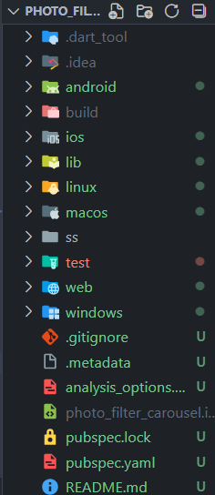
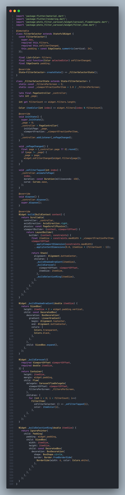
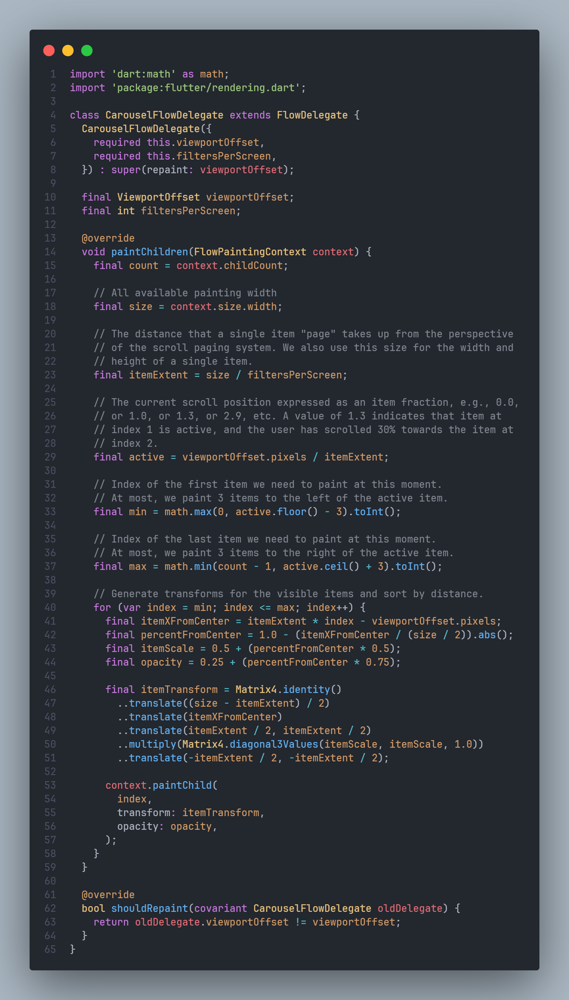
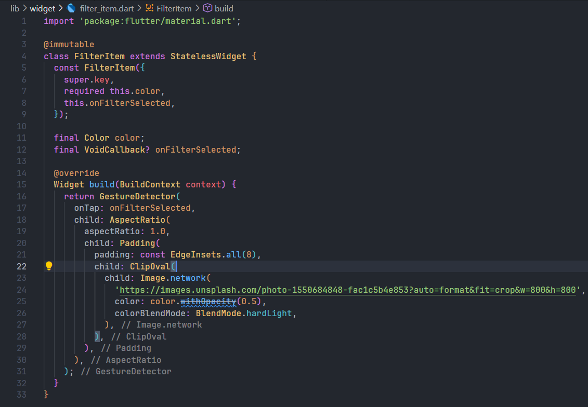
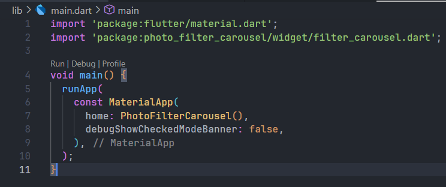
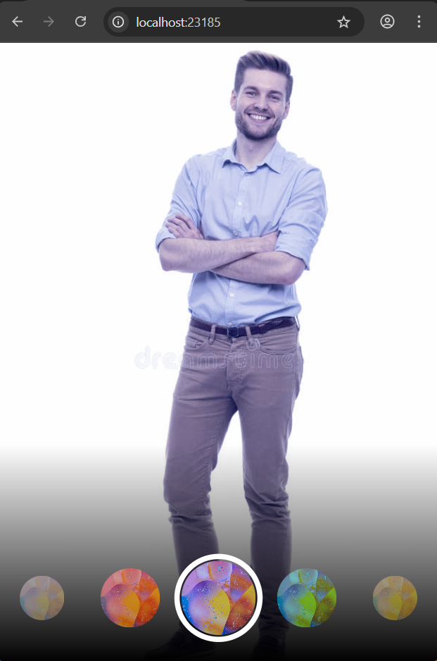
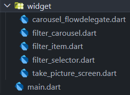
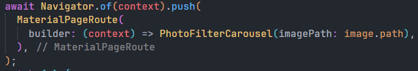
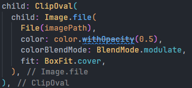
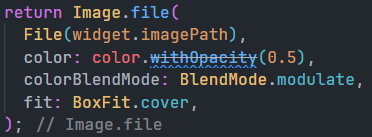

# Praktikum 1 : Mengambil Foto dengan Kamera di Flutter

## Langkah 1 : Buat Project Baru


## Langkah 2: Tambah dependensi yang diperlukan


## Langkah 3: Ambil Sensor Kamera dari device


## Langkah 4: Buat dan inisialisasi CameraController


## Langkah 5: Gunakan CameraPreview untuk menampilkan preview foto


## Langkah 6: Ambil foto dengan CameraController


## Langkah 7: Buat widget baru DisplayPictureScreen


## Langkah 8: Edit main.dart


## Langkah 9: Menampilkan hasil foto


## Hasil Running : 


# Praktikum 2 : Membuat photo filter carousel

## Langkah 1 : Buat Project Baru


## Langkah 2: Buat widget Selector ring dan dark gradient


## Langkah 3: Buat widget photo filter carousel


## Langkah 4: Membuat filter warna - bagian 1


## Langkah 5: Membuat filter warna


## Langkah 6: Implementasi filter carousel


## Hasil Running : 



# Tugas Praktikum

## Selesaikan Praktikum 1 dan 2, lalu dokumentasikan dan push ke repository Anda berupa screenshot setiap hasil pekerjaan beserta penjelasannya di file README.md! Jika terdapat error atau kode yang tidak dapat berjalan, silakan Anda perbaiki sesuai tujuan aplikasi dibuat!

## Gabungkan hasil praktikum 1 dengan hasil praktikum 2 sehingga setelah melakukan pengambilan foto, dapat dibuat filter carouselnya!

buat project baru

copy semua file di praktikum 1 dan 2 kecuali file display_picture_screen karena akan diganti file filter_carousel



dan ganti pada take_picture_screen untuk mengarah ke PhotoFilterCarousel



lakukan perubahan pada filter_selector pada saat menampilkan image di dalam ring nya



lakukan perubahan pada filter_item agar ketika menampilkan gambar adalah gambar yang di photo


lakukan perubahan pada filter_carousel agar dapat mengaplikasikan filter ke gambar yang di photo



## Jelaskan maksud void async pada praktikum 1?

```
Future<void> main() async{
  WidgetsFlutterBinding.ensureInitialized();

  final cameras = await availableCameras();

  final firstCamera = cameras.first;

  runApp(
    MaterialApp(
      theme: ThemeData.dark(),
      home: TakepictureScreen(
        // Pass the appropriate camera to the TakePictureScreen widget.
        camera: firstCamera,
      ),
      debugShowCheckedModeBanner: false,
    ),
  );
}
```
dalam kode main tersebut menggunakan method async dan return Future

1. async adalah fungsi asinkronis yang akan menunggu sampai proses yang di jalankan selesai dimana proses yang di tunggu adalah pemanggilan dari availableCameras() ditandai dengan await 
2. Future adalah nilai balik yang dihasilkan dari fungsi bertipe async yang mana ini harus dilakukan dalam dart agar dapat memperoleh nilai dari function yang telah di jalankan tadi 

## Jelaskan fungsi dari anotasi @immutable dan @override ?

@immutable berarti semua field/properti di class yang menggunakan anotasi ini harus bersifat final (konstan) dan tidak boleh dimodifikasi setelah objek dibuat

@override berarti bahwa sebuah method, getter, atau setter sedang menimpa implementasi dari superclass atau interface.