# Praktikum 1 : Mengambil Foto dengan Kamera di Flutter

## Langkah 1 : Buat Project Baru
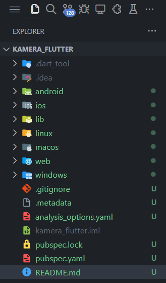

## Langkah 2: Tambah dependensi yang diperlukan
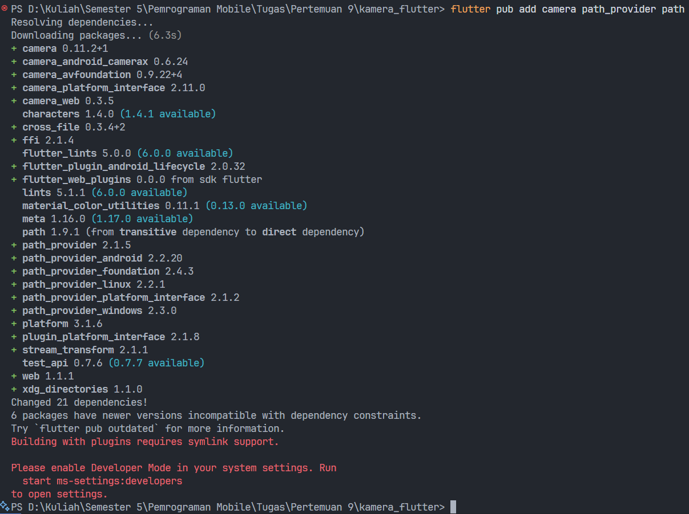

## Langkah 3: Ambil Sensor Kamera dari device
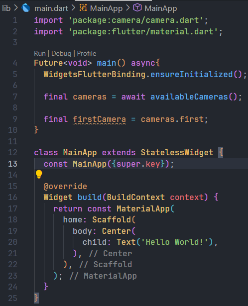

## Langkah 4: Buat dan inisialisasi CameraController
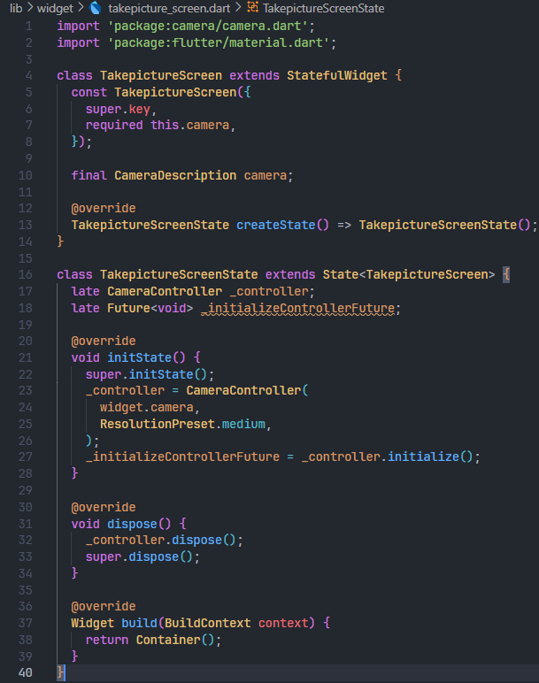

## Langkah 5: Gunakan CameraPreview untuk menampilkan preview foto
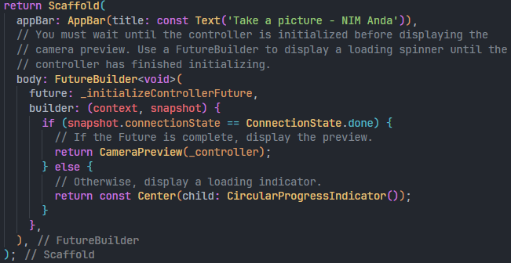

## Langkah 6: Ambil foto dengan CameraController
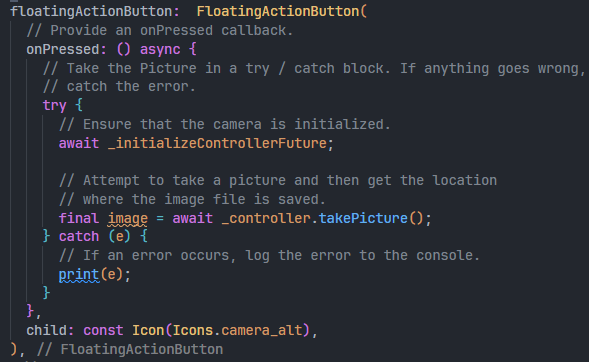

## Langkah 7: Buat widget baru DisplayPictureScreen
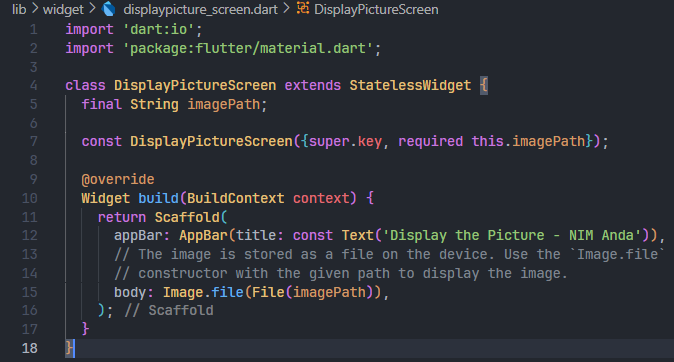

## Langkah 8: Edit main.dart
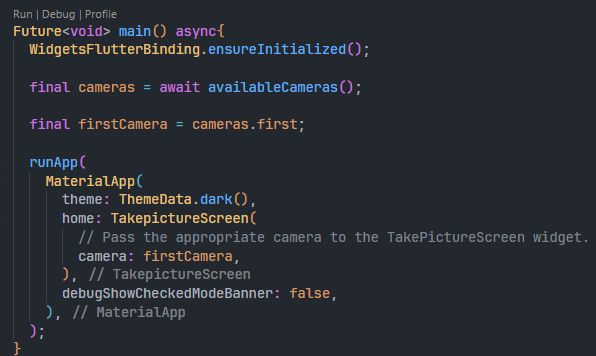

## Langkah 9: Menampilkan hasil foto
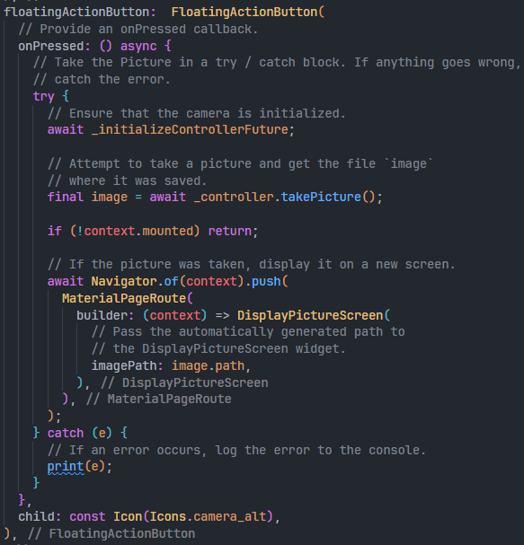

## Hasil Running : 
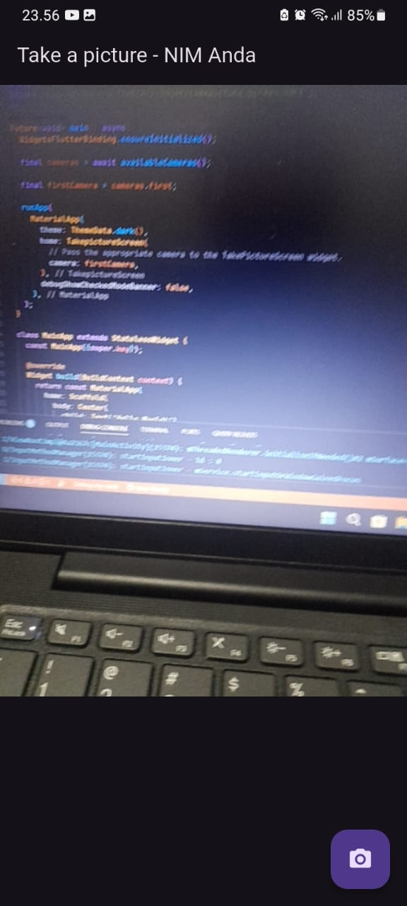
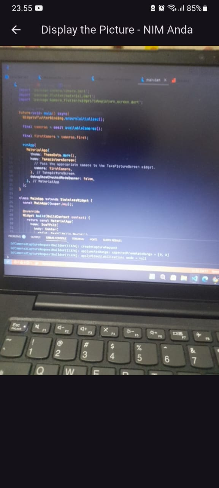

